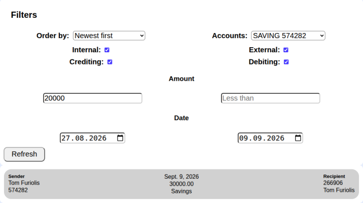
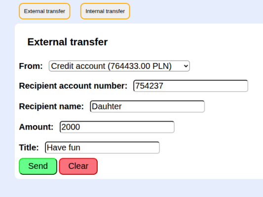
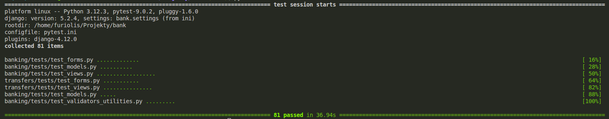

# Fake Bank 
Fake Bank is my personal project to present and practice my programming skills.

 

## Features
- Client registration and authentication
- Open bank accounts and create linked cards
- Make transfers
- Take loans
- View transaction history

## Tech Stack
- Python
- Django
- pytest
- Django Debug Toolbar
- SQLite
- Git
- Ubuntu

## Localisation
is achieved with Django Locale Middleware. Flags are the switcher.
Available languages: English, Polish

 

## Architecture
- `bank` is the initial django directory, contains project settings and main URL configuration.
- `banking` responsible for managing clients, accounts, and cards.
- `transfers` additional app responsible for transfers between accounts, and history of those transfers

## Installation Ubuntu/Linux
1. Python tested on version 3.12, git
2. Project downloading `git clone https://github.com/Furiolis/bank.git` and then `cd bank`
3. Virtual environment `python3 -m venv vvv`
4. Activate virtual environment `source vvv/bin/activate`
5. Install dependencies `python3 -m pip install -r requirements.txt`
6. SECRET_KEY is expected in .env in main directory. To generate 
`python3 -c "from django.core.management.utils import get_random_secret_key; print('SECRET_KEY=' + get_random_secret_key())" >> .env`
7. Migration required `python3 manage.py migrate`

## Development server
To run `python3 manage.py runserver`
http://127.0.0.1:8000/

## Testing
To run `python3 manage.py test` or `pytest`

Tests are provided for models unique validators and mechanics, forms, and views with forms validation. Both, valid and invalid case, are covered.

# Things to do
- TODO Django Rest Framework
- TODO Two-factor authentication (2FA)

- TODO Password restore or edit
- TODO Card pin to restore or edit